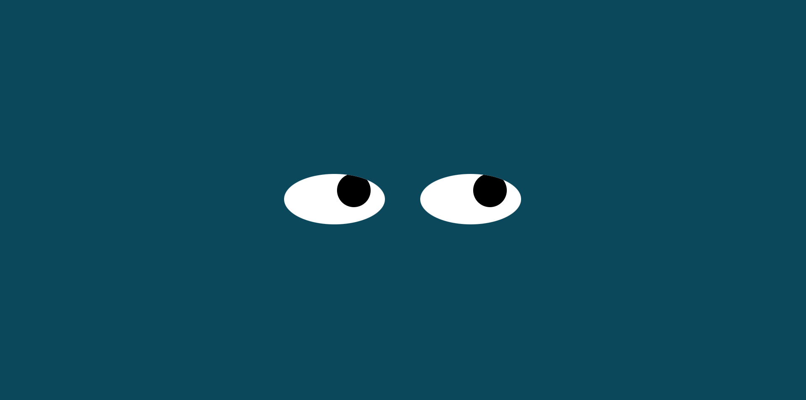

#  Title of the project: Eyes

## Description of the project:

 This project is an Exercise on a cursor tracking set of eyes. It was a mostly 
 straight forward. Converting from one eye to two eyes on the page 

## How to Use:
  No secrets here, just move your cursor around the page.

## Roadmap of future improvements: 
  If I were to attempt changing the project I would consider having both eyes 
track the cursor even when it's centered between the eyes. It would require 
individual tracking.

## Appearance:

## License information: 

MIT License

Copyright (c) 2023 Theo Bueno

Permission is hereby granted, free of charge, to any person obtaining a copy
of this software and associated documentation files (the "Software"), to deal
in the Software without restriction, including without limitation the rights
to use, copy, modify, merge, publish, distribute, sublicense, and/or sell
copies of the Software, and to permit persons to whom the Software is
furnished to do so, subject to the following conditions:

The above copyright notice and this permission notice shall be included in all
copies or substantial portions of the Software.

THE SOFTWARE IS PROVIDED "AS IS", WITHOUT WARRANTY OF ANY KIND, EXPRESS OR
IMPLIED, INCLUDING BUT NOT LIMITED TO THE WARRANTIES OF MERCHANTABILITY,
FITNESS FOR A PARTICULAR PURPOSE AND NONINFRINGEMENT. IN NO EVENT SHALL THE
AUTHORS OR COPYRIGHT HOLDERS BE LIABLE FOR ANY CLAIM, DAMAGES OR OTHER
LIABILITY, WHETHER IN AN ACTION OF CONTRACT, TORT OR OTHERWISE, ARISING FROM,
OUT OF OR IN CONNECTION WITH THE SOFTWARE OR THE USE OR OTHER DEALINGS IN THE
SOFTWARE.

<Add it to your code: https://opensource.org/license/mit/>